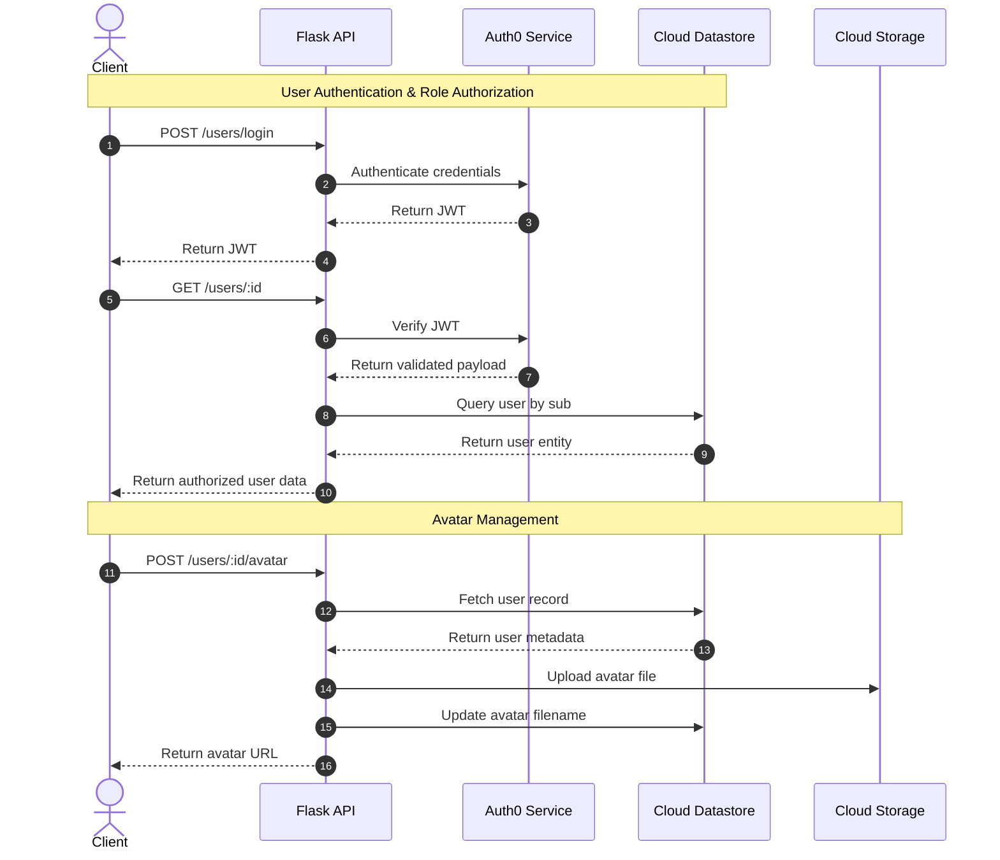

# Tarpaulin API

## Overview

Tarpaulin API is a cloud hosted backend course management system inspired by learning management platforms such as Canvas. 

This program focuses exclusively on backend development and demonstrates authentication, authorization, database management, file storage integration, and cloud deployment using Google Cloud Platform.

## Features

- Secure RESTful API with JWT authentication
- Role based access control for administrators, instructors, and students
- Course, enrollment, and user management
- Avatar upload and retrieval using Google Cloud Storage
- Persistent data storage with Google Cloud Datastore
- Cloud deployment using Google App Engine

## UML Diagram - Workflow

The following sequence diagram illustrates the authentication, authorization, and avatar management workflows used by the application.

## Cloud Services

### Auth0 Authentication

Auth0 handles user authentication and issues JSON Web Tokens (JWTs). Protected endpoints validate JWTs and enforce role-based permissions.

### Google Cloud Datastore

Datastore serves as the application's primary database, storing user records, course information, and enrollment data.

### Google Cloud Storage

Cloud Storage manages user avatar files and provides scalable object storage for uploaded media.

## Data Model

### Users

| Property         | Data Type | Required | Description                                 |
| ---------------- | --------- | -------- | ------------------------------------------- |
| id               | Integer   | No       | Datastore-generated user identifier.        |
| role             | String    | Yes      | User role (admin, instructor, student).     |
| sub              | String    | Yes      | Auth0 subject identifier.                   |
| avatar_file_name | String    | No       | Filename of avatar stored in Cloud Storage. |

### Courses

| Property      | Data Type | Required | Description                            |
| ------------- | --------- | -------- | -------------------------------------- |
| id            | Integer   | No       | Datastore-generated course identifier. |
| instructor_id | String    | Yes      | Assigned instructor identifier.        |
| number        | Integer   | Yes      | Course number.                         |
| students      | Array     | No       | Enrolled student identifiers.          |
| subject       | String    | Yes      | Course subject code.                   |
| term          | String    | Yes      | Academic term.                         |
| title         | String    | Yes      | Course title.                          |

## Technologies Used

* Python
* Flask
* Google App Engine
* Google Cloud Datastore
* Google Cloud Storage
* Auth0
* JWT Authentication
* REST APIs
* Postman
